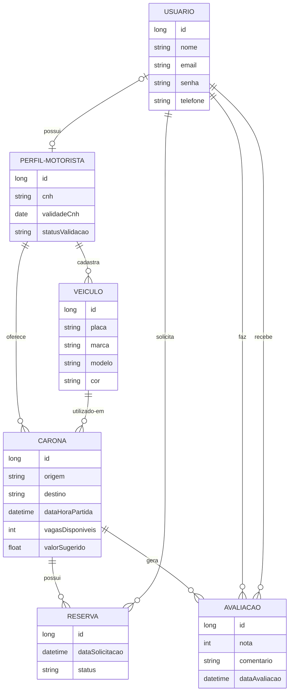

    ## 🏛️ Arquitetura do Backend: Arreda
Este documento define o modelo relacional de dados e as diretrizes arquiteturais técnicas do projeto. O modelo abrange os princípios de manutenção, desempenho e a escalabilidade contínua da API do aplicativo visando gerenciar o tráfego da rede de caronas.

Nosso projeto segue a **Arquitetura em Camadas**. O objetivo desse padrão é a *Separação de Responsabilidades*: cada pasta faz apenas uma coisa específica. Se der erro no banco de dados, sabemos exatamente em qual pasta procurar.

---

## 📂 Estrutura de Pastas do Projeto

```text
src/main/java/com/arreda/backend/
├── ArredaApplication.java       # Arquivo principal que liga o servidor
├── controllers/                 # Recepcionistas da API (Endpoints)
├── dtos/                        # Filtros de entrada e saída (Segurança)
├── models/ (ou entities/)       # O coração do sistema (Classes POO)
├── repositories/                # Comunicação direta com o Banco de Dados
├── services/                    # O cérebro do sistema (Regras de Negócio)
└── exceptions/                  # Tratamento de erros e exceções customizadas

```

---

##  Diagrama de Banco de Dados (Entidade-Relacionamento)


